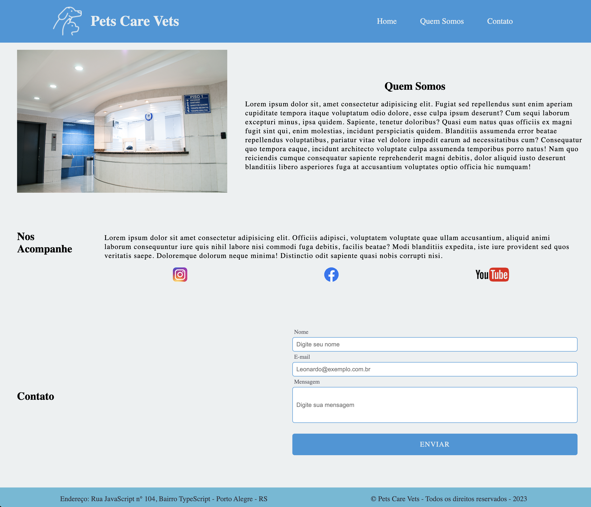

## Objetivo

Criar um site com a utilização de elementos de imagens, formulários, títulos e fontes customizadas. Adicionar também uma label para cada campo e referenciar essa label ao ID que será atribuído ao campo;
## Créditos de Imagens e Ícones

- Foto de <a href="https://unsplash.com/pt-br/@mdominguezfoto?utm_content=creditCopyText&utm_medium=referral&utm_source=unsplash">Martha Dominguez de Gouveia</a> na <a href="https://unsplash.com/pt-br/fotografias/nMyM7fxpokE?utm_content=creditCopyText&utm_medium=referral&utm_source=unsplash">Unsplash</a>
- <a href="https://www.flaticon.com/br/icones-gratis/animais-de-estimacao" title="animais de estimação ícones">Animais de estimação ícones criados por iconfield - Flaticon</a>

## Tecnologias Utilizadas

 </a>
 </a>

## Resultado

## Link de Acesso

[Acesso ao Site](https://pets-care-vets.vercel.app/)

